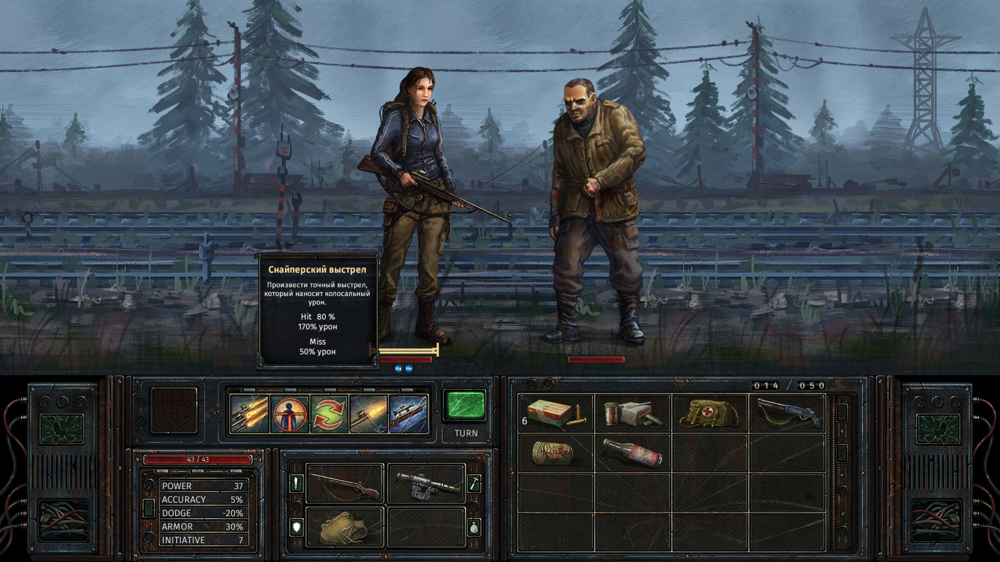

# Railroad

## 2016-08-24

Тактическая ролевая игра в мире пост апокалиптического СССР 80-х годов. Действие происходит вдоль железнодорожного пути,
с узнаваемыми, для любого россиянина, пейзажами. По пути игрок встречает фантастических тварей, продукты деятельности
советских НИИ, развалины прежнего режима.

> разработка, игры, портфолио
