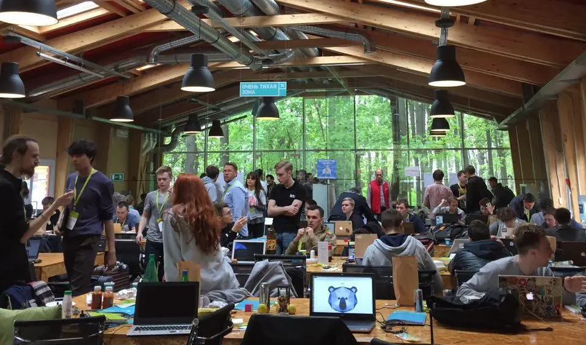

# Brenna

## 2017-07-01

[vimeo](https://player.vimeo.com/video/235624892?badge=0&amp;autopause=0&amp;player_id=0&amp;app_id=58479)

Очередная попытка модернизировать жанр тактических пошаговых сражений. Отсутствие регулярной сетки, интерактивные и
квестовые элементы на поле боя, стройная ККИ подобная боевая механика. Впервые использовал покупные ассеты. Это
значительно упрощает разработку игр на этапе прототипирования.

> разработка, игры

## 2017-05-20

Компания S7 провела хакатон на котором мы делали приложение для совместного выбора авиабилетов через телеграм бот.
Главной фичей была интерактивность в режиме реального времени, насколько это возможно в рамках работы стандартного
телеграм виджета сообщений с кнопками.

> разработка, хакатоны