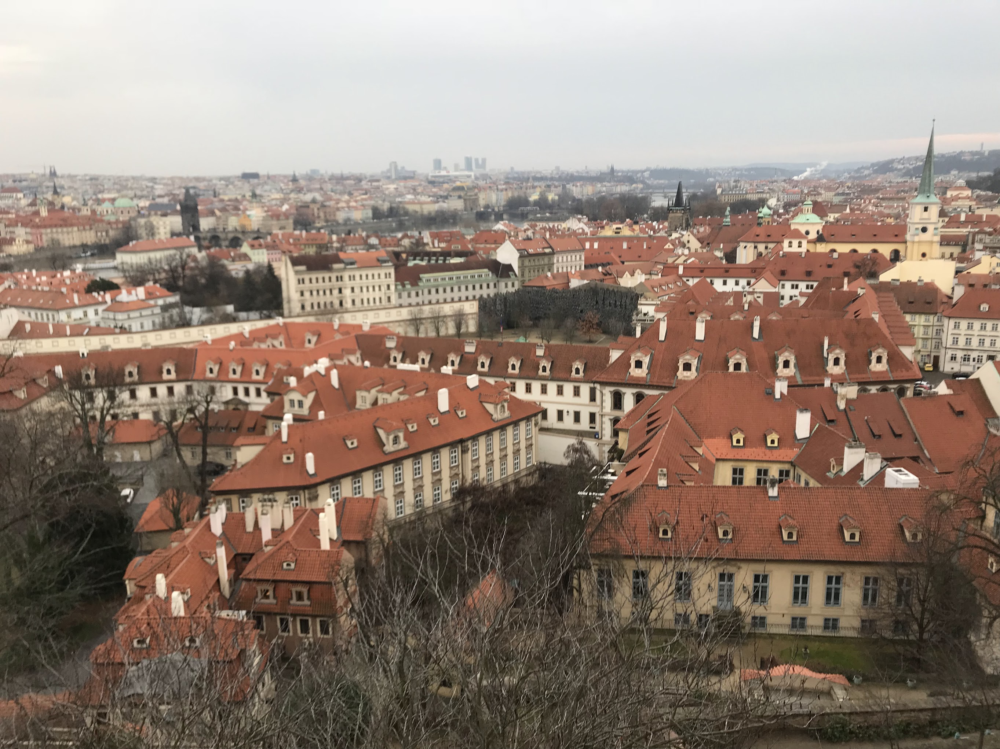

# Malva

## 2018-10-06

[vimeo](https://player.vimeo.com/video/855921050?badge=0&amp;autopause=0&amp;player_id=0&amp;app_id=58479)

Фантазии и личные размышления на тему 1917 года. Затянувшаяся мировая война запустила процесс свержения монархии и
создания нового правительства. Игрок участвует в этом действии от лица народной партии, которая стремится распространить
свое влияние и власть в стране.

> разработка, игры, портфолио

# Поездка в Европу

## 2018-02-01

Ничего не планировали с друзьями по работе, сорвались одним вечером и поехали в Европу. Было интересно посмотреть на
Прагу, Барселону, Турин. Заметил что разговорный английский сильно лучше идёт когда реально хочешь покушать и нужно
узнать дорогу до кафе в котором у тебя включено питание от гостиницы.

> отдых, путешествия