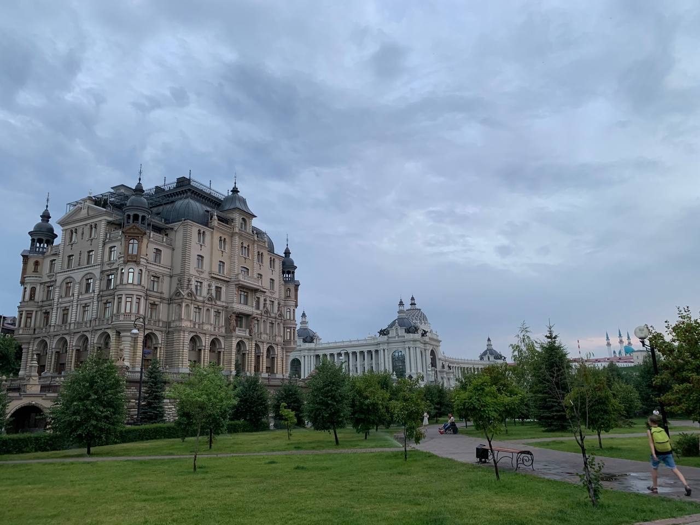
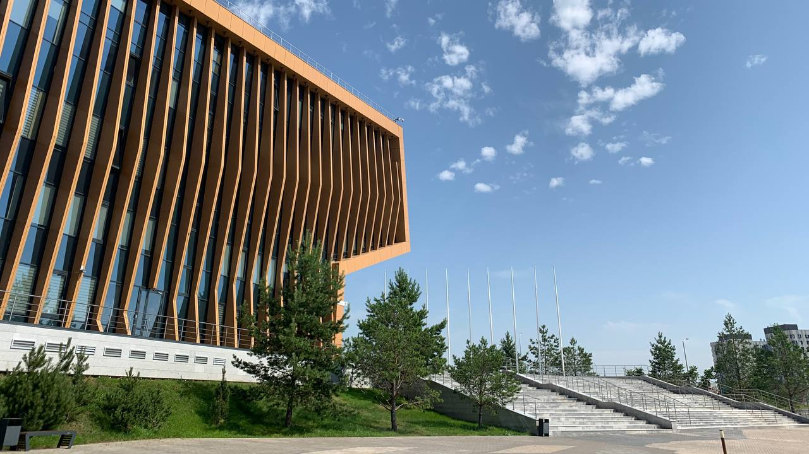

# Поездка в Казань

## 2020-07-01

### 55.796127, 49.106414

Казань стала первым местом, куда мы с другом отправились развеяться после пандемии ковида. Новая набережная, белый
кремль, коммерческие пространства для туристов и интересная архитектура. Всё это стало началом для моего нового
увлечения путешествовать по России.

> блог, путешествия

# Посещение Иннополиса

## 2020-07-02

### 55.796127, 49.106414

На мой взгляд Казань сейчас в топе IT городов, не в последнюю очередь благодаря Иннополису. Если бы я хотел получить
высшее образование, то мечтал бы попасть именно сюда. Красивый университет, беспилотные автомобили на дорогах, филиалы
технических компаний.

> блог, путешествия