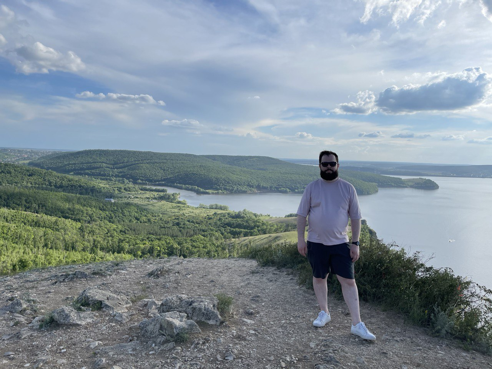

# Spacebox

## 2021-07-02

[vimeo](https://player.vimeo.com/video/581046421?badge=0&amp;autopause=0&amp;player_id=0&amp;app_id=58479)

Попытка совместить жанры стратегии и РПГ. Пока один игрок стратегически отправляет корабли к освоению новых планет,
второй управляет одним из кораблей, а третий занимается фермерством, обустройством или боевой подготовкой перед высадкой
на планету.

> разработка, игры

# Поездка в Самару

## 2021-06-05

Придумали с друзьями новый формат, коворкинг по городам России. В самую обычную рабочую неделю отправились в Самару.
Прекрасный город: исторические и культурные объекты, отличный отель LOTTE, вкусные рестораны и красивая природа в
парке «Самарская Лука».

> блог, путешествия