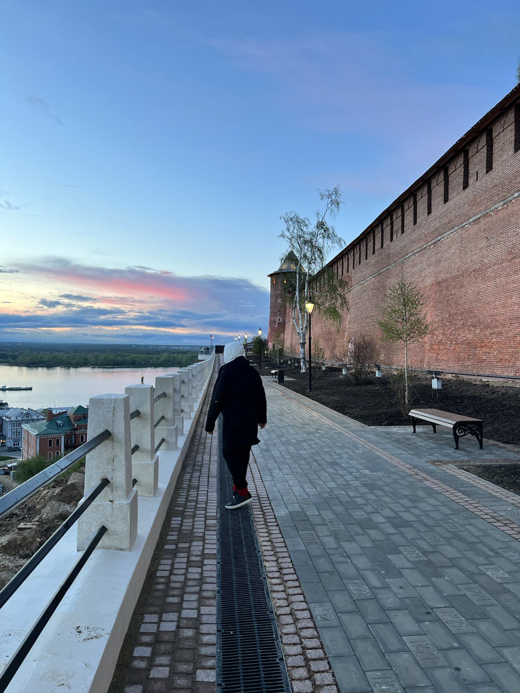

# Поездка в Нижний Новгород

## 2022-05-17

В Нижнем Новгороде карты считают количество лестниц. Мы сначала не поняли, а потом как поняли зачем это нужно во время
прогулок. Классный город: обустроенные городские пространства, кремль, крутой ресторан «Экспедиция». В планах попасть
как-нибудь на нижегородскую ярмарку.

> отдых, путешествия

# Разработка libfmod

## 2022-03-20

[link](https://github.com/lebedec/libfmod)

Выбрал Rust для разработки игры. Проблема в том, что экосистема языка ещё молода, большинство решений находятся на
стадии прототипирования или вовсе отсутствуют. Чтобы закрыть вопрос создания аудио сопровождения для игры, сделал
библиотеку обёртку для FMOD.

> разработка, OpenSource