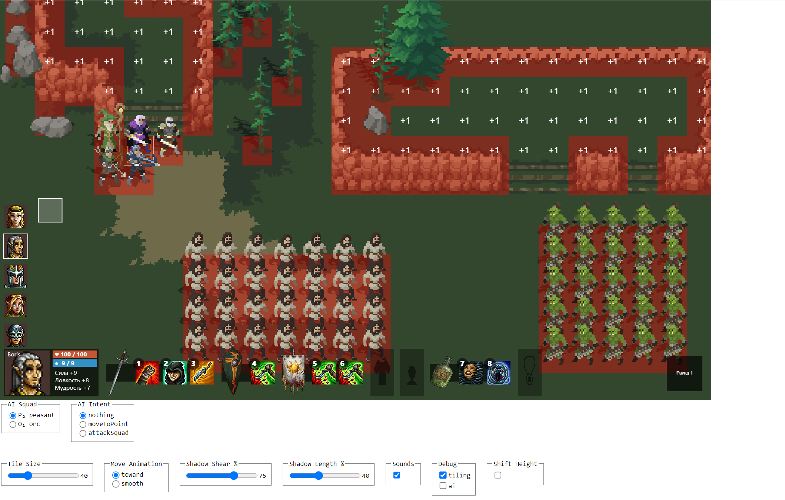
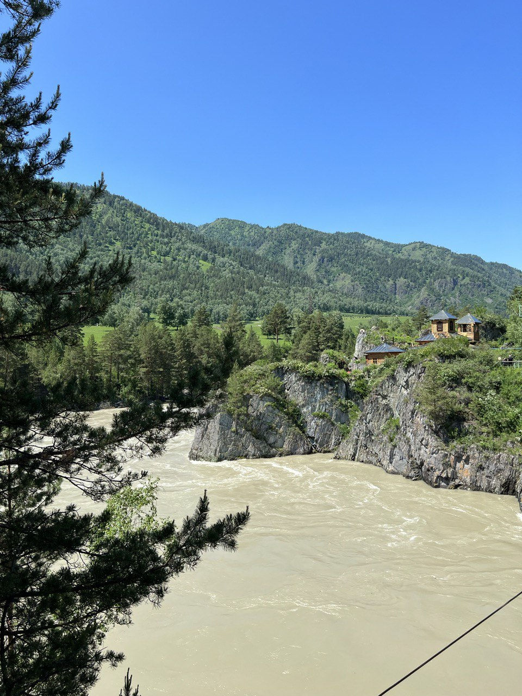
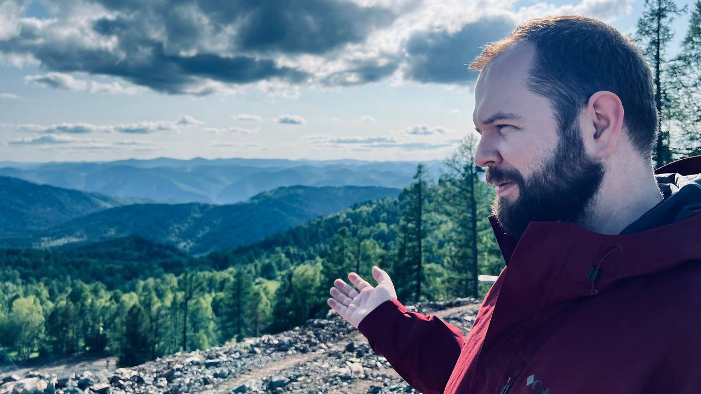

# Topic 1

## 2023-09-01

Начал подготовку к созданию новой игры под рабочим названием «Старины». Будет по-настоящему эпичная пошаговая тактика в
атмосфере славянского фентези: сотни юнитов на поле боя, изменение рельефа и разрушения замков под ударами мощной магии,
большие монстры помещаются на экран только со стратегического вида.

> разработка, игры

# Запуск разработки игры «Старины»

## 2023-07-23

Начал подготовку к созданию новой игры под рабочим названием «Старины». Будет по-настоящему эпичная пошаговая тактика в
атмосфере славянского фентези: сотни юнитов на поле боя, изменение рельефа и разрушения замков под ударами мощной магии,
большие монстры помещаются на экран только со стратегического вида.

> разработка, игры

# Запуск разработки игры «Старины»

## 2023-06-17

Несколько лет думал посетить горный Алтай. Природа Алтая уникальна во всех своих проявлениях, и настолько богата
невероятными пейзажами, что наслаждаться их красотой можно вечно.

> отдых, путешествия

# Запуск разработки игры «Старины»

## 2023-06-15

Несколько лет думал посетить горный Алтай. Природа Алтая уникальна во всех своих проявлениях, и настолько богата
невероятными пейзажами, что наслаждаться их красотой можно вечно.

> отдых, путешествия

# Topc 2

## 2023-08-23

[youtube](https://www.youtube.com/embed/qJ16vPIZpqc?si=AgNLJohMoRE9Z976&start=1202)

Lorem ipsum dolor sit amet, consectetur adipiscing elit, sed do eiusmod tempor incididunt ut labore et dolore magna
aliqua. Ut enim ad minim veniam, quis nostrud exercitation ullamco laboris nisi ut aliquip ex ea commodo consequat.

Duis aute irure dolor in reprehenderit in voluptate velit esse cillum dolore eu fugiat nulla pariatur. Excepteur sint
occaecat cupidatat non proident, sunt in culpa qui officia deserunt mollit anim id est laborum.

> tag, super

# Topic 3

## 2023-07-14

[youtube](https://www.youtube.com/embed/qJ16vPIZpqc?si=AgNLJohMoRE9Z976&start=1202)

Для систем проектирования инженерных сетей важно в первую очередь получить корректный результат, который не противоречит
инженерным и санитарным нормам. Поэтому мы использовали детерминированный алгоритм инверсной кинематики из сферы
робототехники.

Модель кинематической цепи идеально описывает профиль подключения сантехнического прибора к трассе водоотведения,
гарантирует точное позиционирование и соосность фитингов и труб. Не менее важным является способ представления системы
так, чтобы инженеры разной квалификации могли легко и однозначно интерпретировать результаты расчётов.

Поэтому мы реализовали приложение, в центре которого 3D проекция трассы водоотведения с интерактивными элементами
управления. Изменение параметров расчёта приводит к обновлению этой проекции в режиме реального времени. В итоге наше
приложение уменьшает трудоёмкость проектирования сетей водоотведения.

> разработка, хакатон, выступление, путешествие, игрострой

# Topic 4

## 2023-07-21

Для систем проектирования инженерных сетей важно в первую очередь получить корректный результат, который не противоречит
инженерным и санитарным нормам. Поэтому мы использовали детерминированный алгоритм инверсной кинематики из сферы
робототехники.

> a, b, c
