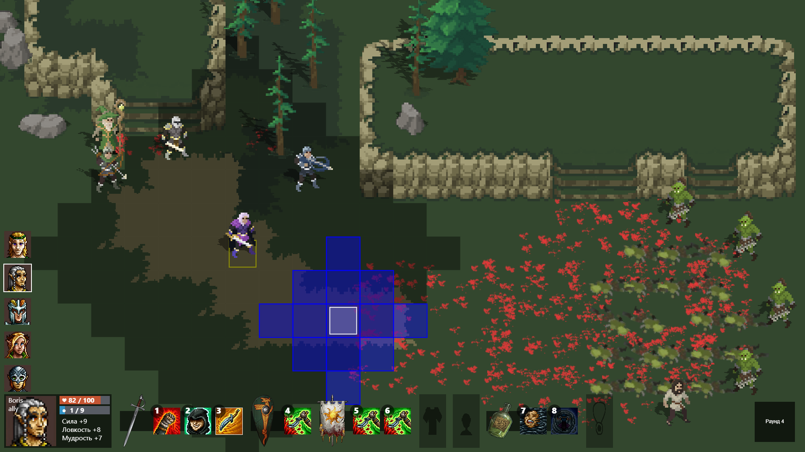
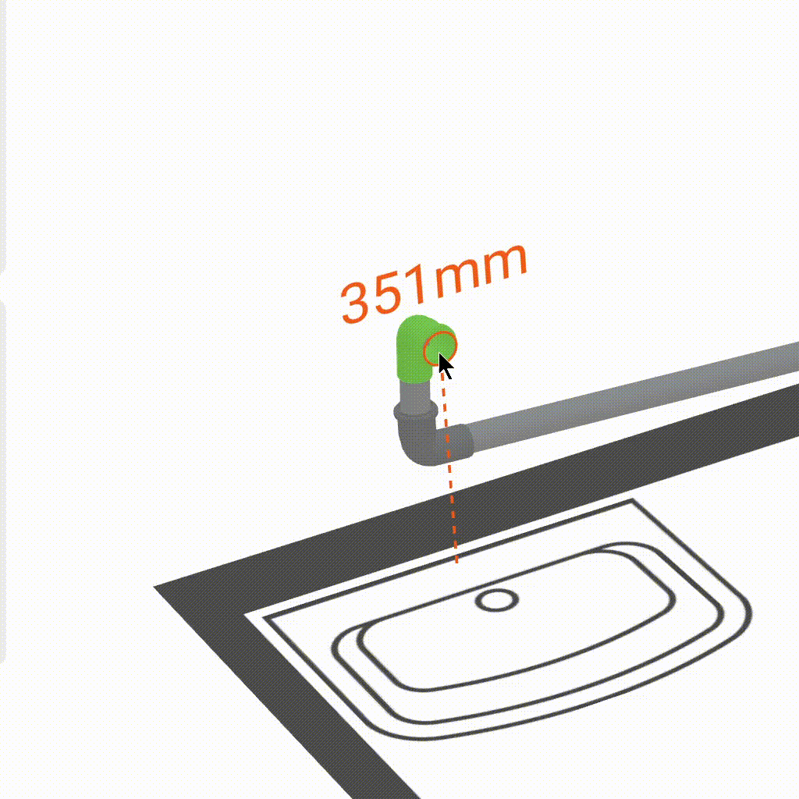

# Запуск разработки игры «Старины»

## 2023-07-23

Начал подготовку к созданию новой игры под рабочим названием «Старины». Будет по-настоящему эпичная пошаговая тактика в
атмосфере славянского фентези: сотни юнитов на поле боя, изменение рельефа и разрушения замков, большие монстры
помещаются на экран только со стратегического вида.

> блог, игры, старины

# Природа горного Алтая

## 2023-06-14

### 51.831444, 85.776563

В молодости, как и многие мои знакомые, я мечтал посетить Исландию или Новую Зеландию из-за магической притягательности
природных пейзажей. Но не обязательно лететь так далеко, в России много мест с подобным эффектом. Горный
Алатай однозначно в топе.

> блог, путешествия

# Путешествие в горный алтай

## 2023-06-13

### 51.831444, 85.776563

Несколько лет думал посетить горный Алтай. Сейчас частные компании вливают деньги в развитие туризма, поэтому не
обязательно начинать с диких походов по горам. По реке Катунь расположено много вариантов: от бюджетных турбаз до
комфортабельных шале с ресторанами питерского уровня.

> блог, путешествия

# Питч решения на ЛЦТ 2023

## 2023-06-11

[youtube](https://www.youtube.com/embed/qJ16vPIZpqc?si=AgNLJohMoRE9Z976&start=1202)

Финал ЛЦТ 2023 проходил в два этапа: в первый день знакомились с экспертами, во второй питч-сессия. Настроение было
боевое. Другие команды показали очень крутые решения. Мы объективно заняли второе место и были рады этому.

> разработка, хакатоны

# Подготовка для ЛЦТ

## 2023-05-23

Для решения задачи разводки труб канализации в хакатоне ЛЦТ 2023 использовал инверсную кинематику. Модель кинематической
цепи идеально описывает профиль подключения сантех приборов к трассе водоотведения, гарантирует точное позиционирование
и соосность фитингов и труб.

> разработка, хакатоны

