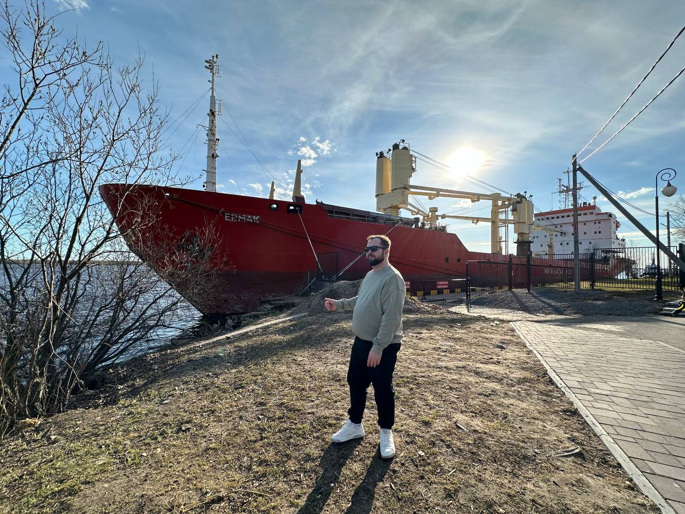

# Архангельск

## 2024-05-20

### 64.539911, 40.515762

Архангельск — ворота в Арктику, возможно столица Северного морского пути. 
Отправились туда чтобы настроиться на решение задачи по навигации атомных ледоколов. 
Новый отель и отличный ресторанный уровень на набережной и в старой части города, порты, Корела... 
Всё очень понравилось. 

> блог, путешествия

# Питч решения на ЛЦТ 2024

## 2024-06-24

[rutube](https://rutube.ru/play/embed/ba13ae19131f38abcf446f6699b6e31f/?p=dlCNJP60hRaI1PvHtrA6NQ)

В этот раз ЛЦТ 2024 проходил в более компактном по срокам формате. На разработку было всего
две недели, но в целом сильно помог опыт прошлого года. Несколько участников показали классные решения, 
за первое место пришлось побороться.

> разработка, хакатоны

# Агентство довровых дел

## 2024-06-11

Для решения задачи по наполнению дворов в ЛЦТ 2024 использовали карты влияния и
определение доминант, которые дают согласованное наполнение и выступают в качестве эвристик для алгоритмов оптимизации. 
Для поиска концептуального решения использовали теорию ТРИЗ.

> разработка, хакатоны